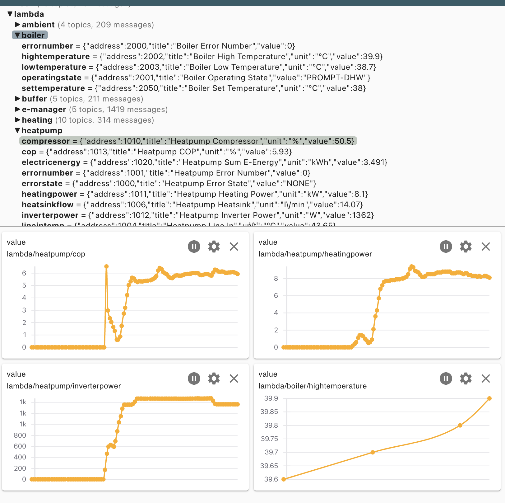
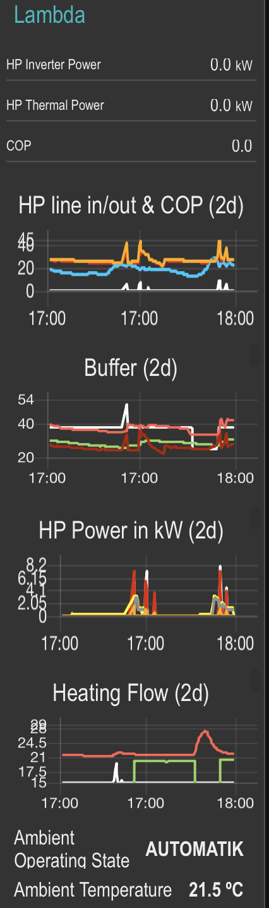

# modbus2mqtt - Bidirectional Modbus 2 MQTT Bridge

**modbus2mqtt** allows you to have any modbus capable device (Ethernet/USB/Serial) being available and manipulatable in MQTT.

It comes with json definition files for:

 - Lambda Eureka series heatpumps (EU8L, EU13L EU15L)
 - Phoenix Contact electric vehicle chargecontroller
 - Hanmatek HM310T laboratory power supply
 - SMA sunnyboy/-store inverters (left in here, even though [sma2mqtt](https://github.com/jollyjinx/sma2mqtt) is better for that use case)
 - GoodWe ET 15-30 inverter
 
and you can easily add json definition files for your own devices.

## Docker Container Use

A Docker image, specifically engineered for 64-bit ARM architecture, is available. This image is compatible with a range of devices, including the Raspberry Pi, Apple Silicon Macs, and other 64-bit ARM computers. It can be employed directly using the following command:

```
	docker run --name modbus2mqtt \
		jollyjinx/modbus2mqtt:latest modbus2mqtt \
		--modbus-server lambda \
		--mqtt-servername=mqtt.local \
		--topic lambda \
		--device-description-file lambda.json
```

This runs **modbus2mqtt** for a lambda heatpump and output the values to the mqtt server topic /lambda. If there is no mqtt server specified the server named *mqtt* is used.

This will look like the following on *MQTT Explorer* or in *node-red*:



You can create your own docker container by using the following command:

```
    docker build . --file modbus2mqtt.product.dockerfile --tag modbus2mqtt
    docker run --name modbus2mqtt modbus2mqtt --modbus-server lambda --device-description-file lambda.json --topic lambda
```

## JSON Definition Files

It's easy to setup your own **modbus2mqtt** definition file. A json definition file looks like this:

```
{
  {
    "address": 40631,                   // modbus address
    "modbustype": "holding",            // holding,coil,
    "modbusaccess": "readwrite",        // read/write/readwrite
    "valuetype": "string",              // string, ipv4address, macaddress, uint8, int8, uint16,...
    "length": 24,                       // strings need a length
    "interval": 1000,                   // interval being updated in seconds (decimal value like 0.2 possible)
                                        // interval of 0 means it will be requested only at start and then 
                                        // using mqtt retain to retain it.
    "mqtt": "visible",                  // if shown in mqtt visible/invisible/retained
    "topic": "settings/name",           // topic to post values
    "title": "Name"                     // description for gui (like node-red)
  },
  {
    "address": 30581,
    "modbustype": "holding",
    "modbusaccess": "read",
    "valuetype": "uint32",  
    "factor": 0.001,                    // factor to multiply by
    "unit": "kWh",                      // unit for gui
    "mqtt": "visible",
    "interval": 1000,
    "topic": "counter/totalusage",
    "title": "Total Yield"
  },
  {
    "address": 1,
    "modbustype": "holding",
    "modbusaccess": "read",
    "valuetype": "uint16",
    "mqtt": "visible",
    "interval": 5,
    "map": {                            // you can add mappings for values
        "0": "OFF",                     // so value will be "AUTOMATIC" if the 
        "1": "AUTOMATIK",               // raw value is 1
        "2": "MANUAL",                  // original values can then be accessed with  
        "3": "ERROR"                    // "rawValue" key in the output
    },
    "topic": "ambient/operatingstate",
    "title": "Ambient Operating State"
  },
  {
    "address": 2,
    "modbustype": "holding",
    "modbusaccess": "read",
    "valuetype": "uint16",
    "mqtt": "visible",
    "interval": 5,
    "bits": {                            // you can bit mappings for values
        "0": { "name" : "running" },     // a single bit will be mapped to a boolean
        "1-3": { "name" : "mode" },      // multiple values will be mapped to the integer number with those bits shifted to the right
        "4-15": { "name" : "reserved" }  
    },
    "topic": "test/state",
    "title": "Test State"
  }
}
```

Remark: Be aware that json does not support comments like in this example.
After creating your own json definition, you can use it with the commandline option *--device-description-file yourfilename* 

## Bridge goes both ways

**modbus2mqtt** is a bridge it does not only allow modbus devices show up in mqtt, it also allows writing values to the modbus devices from mqtt.
It uses a Request/Response pattern. You send a mqtt request to the mqtt request topic and are give the result of the request in the response topic path.

To set the output voltage of the HM310T to 14.04 Volt you can send the following json 

```
{
  "value": 14.04,
  "date": "2022-10-21T08:43:22Z",
  "topic": "set/voltage",
  "id": "D2129DBF-9F94-46D7-86BC-4A07152FF1D8"
}
```

to the topic *hm310/request/mychange* of the MQTT server. The bridge will pickup the request and return the response to the response topic *hm310/response/mychange* .
Be aware that you set the value 14.04 which will be correctly converted to the (u)int16 value of the specific modbus address.

In swift Request/Responses are defined as follows.

```
struct MQTTRequest:Encodable,Decodable,Hashable,Equatable
{
    let date:Date       // needs to be within request ttl time 
    let id:UUID
    let topic:String
    let value:MQTTCommandValue
}

struct MQTTResponse:Encodable,Decodable
{
    let date:Date
    let id:UUID         // same uuid of request
    let success:Bool
    let error:String?
}
```


## Status

I'm using it 24/7 on my own modbus devices (the devices I created JSON definitions for).

Starting the application

```
> modbus2mqtt --topic=sma/sunnystore \
              --modbus-server=sunnyboy.local \
              --mqtt-servername=mqtt.local \
              --device-description-file=sma.sunnystore.json
```

It supports command line help:

```
> ./.build/release/modbus2mqtt --help 
USAGE: modbus2mqtt <options>

OPTIONS:
  --log-level <log-level> Set the log level. (default: notice)
  --mqtt-servername <mqtt-servername>
                          MQTT Server hostname (default: mqtt)
  --mqtt-port <mqtt-port> MQTT Server port (default: 1883)
  --mqtt-username <mqtt-username>
                          MQTT Server username
  --mqtt-password <mqtt-password>
                          MQTT Server password
  --emit-interval <emit-interval>
                          Minimum interval to send updates to mqtt Server.
                          (default: 0.1)
  -t, --topic <topic>     MQTT Server topic. (default: modbus/sunnyboy)
  --mqtt-request-ttl <mqtt-request-ttl>
                          Maximum time a mqttRequest can lie in the future/past
                          to be accepted. (default: 10.0)
  --mqtt-auto-retain-time <mqtt-auto-retain-time>
                          If mqttTopic has a refreshtime larger than this value
                          it will be retained. (default: 10.0)
  --modbus-device-path <modbus-device-path>
                          Serial Modbus Device path
  --modbus-serial-speed <modbus-serial-speed>
                          Serial Modbus Speed (default: 9600)
  -m, --modbus-server <modbus-server>
                          Modbus Device Servername. (default:
                          modbus.example.com)
  --modbus-port <modbus-port>
                          Modbus Device Port number. (default: 502)
  --modbus-address <modbus-address>
                          Modbus Device Address. (default: 3)
  --device-description-file <device-description-file>
                          Modbus Device Description file (JSON). (default:
                          sma.sunnyboy.json)
  -h, --help              Show help information.

```

## Feedback welcome

In case you add json definitions for your own devices, create pull requests. 
