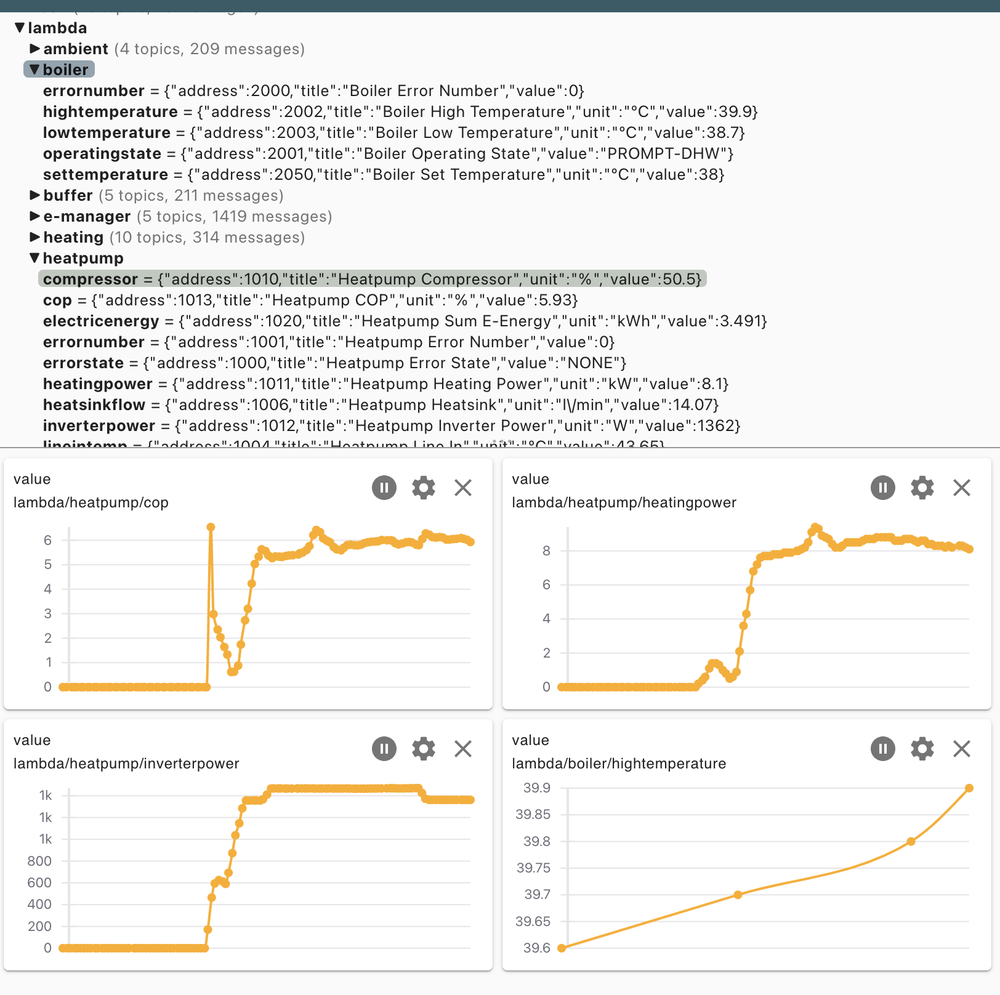
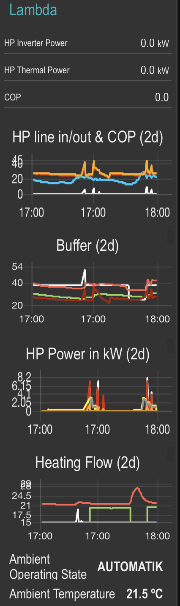

# modbus2mqtt - Bidirectional Modbus 2 MQTT Bridge

**modbus2mqtt** allows you to have any modbus capable device (Ethernet/USB/Serial) being available and manipulatable in MQTT.

It comes with json definition files for:

 - **B+G E-Tech SD100-00B** - Energy meter (`b+ge-tech.sd100-00b.json`)
 - **DaheimLader Wallbox** - Daheimladen Wallbox (`daheimladen.json`)
 - **GoodWe ET 15-30** - Solar inverter (`goodwe-et15-30.json`)
 - **Hanmatek HM310T** - Laboratory power supply (`hanmatek.hm310t.json`)
 - **Lambda Eureka series** - Heatpumps (EU8L, EU13L, EU15L) (`lambda.json`)
 - **Lambda Solartherm** - Heat pump with solar thermal integration (`lambda.solartherm.json`)
 - **NIBE S2125** - Air/water heat pump (`nibe.s2125.json`)
 - **Phoenix Contact** - Electric vehicle charge controller (`phoenix.evcharger.json`)
 - **SMA Sunny Boy** - Solar inverter (`sma.sunnyboy.json` / `sma.sunnyboy.all.json`)
 - **SMA Sunny Boy Storage** - Solar inverter with battery storage (`sma.sunnystore.json` / `sma.sunnystore.all.json`)
 
*Note: `.all.json` versions contain extended register sets. For SMA devices, [sma2mqtt](https://github.com/jollyjinx/sma2mqtt) is recommended for better support.*

You can easily add json definition files for your own devices. All device definitions are available in the [`DeviceDefinitions/`](DeviceDefinitions/) directory.

Additional implementation documentation is available in [`DOCUMENTATION.md`](DOCUMENTATION.md). Agent-oriented documentation files use YAML front matter; this README intentionally stays plain Markdown for GitHub.

## Container Use

Container images are available for both **AMD64** (x86_64) and **ARM64** (aarch64) architectures. These multi-architecture images are compatible with a wide range of devices, including x86 servers, Raspberry Pi, Apple Silicon Macs, and other ARM-based computers. The image can be used directly with the following command:

```
	container run --name modbus2mqtt \
		ghcr.io/jollyjinx/modbus-2-mqtt-bridge:latest modbus2mqtt \
		--modbus-server lambda \
		--mqtt-servername=mqtt.local \
		--topic lambda \
		--device-description-file lambda.json
```

This runs **modbus2mqtt** for a lambda heatpump and output the values to the mqtt server topic /lambda. If there is no mqtt server specified the server named *mqtt* is used.

This will look like the following on *MQTT Explorer* or in *node-red*:



You can create your own container image by using the following command:

```
    container build . --file modbus2mqtt.product.dockerfile --tag modbus2mqtt
    container run --name modbus2mqtt modbus2mqtt --modbus-server lambda --device-description-file lambda.json --topic lambda
```

## Multiple Modbus Devices in One Process

Use `--modbus-devices-file` to serve several Modbus TCP devices from one
`modbus2mqtt` process. The process uses one MQTT connection and groups devices
by `networkAddress` and `port`, creating one Modbus TCP connection for each
unique endpoint. Multiple Modbus unit addresses behind the same TCP gateway
therefore share that gateway connection safely.

For short configurations, the same JSON can be supplied directly with
`--modbus-devices-string`. The string and file options are mutually exclusive.

For example, [`Examples/config/modbus-devices.json`](Examples/config/modbus-devices.json)
configures two B+G E-Tech meters connected to one Waveshare gateway and one
Lambda heat pump on a separate endpoint:

```json
{
  "devices": [
    {
      "networkAddress": "10.112.1.2",
      "port": 502,
      "modbusAddress": 1,
      "topic": "counters/heatpump",
      "deviceDescriptionFile": "b+ge-tech.sd100-00b.json"
    },
    {
      "networkAddress": "10.112.1.2",
      "port": 502,
      "modbusAddress": 2,
      "topic": "counters/boiler",
      "deviceDescriptionFile": "b+ge-tech.sd100-00b.json"
    },
    {
      "networkAddress": "10.112.1.3",
      "port": 502,
      "modbusAddress": 1,
      "topic": "lambda",
      "deviceDescriptionFile": "lambda.json"
    }
  ]
}
```

`port` is optional and defaults to `502`. Device-description paths may name a
definition bundled with the application, as above, or point to a readable JSON
file. MQTT broker, credentials, request TTL, retain, unchanged-value publication,
and emit interval options remain process-wide.

Each entry's `topic` is its MQTT base path. Polling values are published below
that path, for example `counters/heatpump/<definition-topic>`. Write requests
and responses preserve any suffix after `request`:

```text
counters/heatpump/request/change → counters/heatpump/response/change
counters/boiler/request/change   → counters/boiler/response/change
lambda/request/change            → lambda/response/change
```

An optional `deviceResetURL` belongs to the physical endpoint. Every entry
sharing the same `networkAddress` and `port` must therefore either omit it or
specify the same URL. A reset of a shared Waveshare gateway affects all Modbus
units connected through it, and reset attempts are coordinated per endpoint.

Run the example configuration in a container with:

```sh
container run --name modbus2mqtt \
  --volume "$PWD/Examples/config:/config:ro" \
  ghcr.io/jollyjinx/modbus-2-mqtt-bridge:latest modbus2mqtt \
  --mqtt-servername mqtt.local \
  --modbus-devices-file /config/modbus-devices.json
```

An inline Compose-style configuration needs no mounted file:

```yaml
services:
  modbus2mqtt:
    image: ghcr.io/jollyjinx/modbus-2-mqtt-bridge:latest
    command:
      - modbus2mqtt
      - --mqtt-servername
      - mqtt
      - --modbus-devices-string
      - >-
        {"devices":[
          {"networkAddress":"10.112.1.2","port":502,"modbusAddress":1,"topic":"counters/heatpump","deviceDescriptionFile":"b+ge-tech.sd100-00b.json"},
          {"networkAddress":"10.112.1.2","port":502,"modbusAddress":2,"topic":"counters/boiler","deviceDescriptionFile":"b+ge-tech.sd100-00b.json"}
        ]}
```

When either multi-device option is present, its entries provide the TCP endpoints,
unit addresses, MQTT base topics, and device definitions; the corresponding
legacy single-device options must not also be supplied. Without it, the existing
`--modbus-server`, `--modbus-port`, `--modbus-address`, `--topic`,
`--device-description-file`, and serial-device workflow remains unchanged.

## JSON Definition Files

It's easy to setup your own **modbus2mqtt** definition file. A json definition file looks like this:

```
{
  {
    "address": 40631,                   // modbus address
    "modbustype": "holding",            // holding,coil,
    "modbusaccess": "readwrite",        // read/write/readwrite
    "valuetype": "string",              // string, ipv4address, macaddress, uint8, int8, uint16,...
    "length": 24,                       // strings need a length
    "interval": 1000,                   // interval being updated in seconds (decimal value like 0.2 possible)
                                        // interval of 0 means it will be requested only at start and then 
                                        // using mqtt retain to retain it.
    "mqtt": "visible",                  // if shown in mqtt visible/invisible/retained
    "topic": "settings/name",           // topic to post values
    "title": "Name"                     // description for gui (like node-red)
  },
  {
    "address": 30581,
    "modbustype": "holding",
    "modbusaccess": "read",
    "valuetype": "uint32",  
    "factor": 0.001,                    // factor to multiply by
    "unit": "kWh",                      // unit for gui
    "mqtt": "visible",
    "interval": 1000,
    "topic": "counter/totalusage",
    "title": "Total Yield"
  },
  {
    "address": 12,
    "modbustype": "input",
    "modbusaccess": "read",
    "valuetype": "float32",
    "resolution": 100,                  // round to the nearest increment before publishing
                                        // use 0.01 for two decimal places
    "unit": "W",
    "mqtt": "visible",
    "interval": 1,
    "topic": "immediate/power",
    "title": "Active Power"
  },
  {
    "address": 1,
    "modbustype": "holding",
    "modbusaccess": "read",
    "valuetype": "uint16",
    "mqtt": "visible",
    "interval": 5,
    "map": {                            // you can add mappings for values
        "0": "OFF",                     // so value will be "AUTOMATIC" if the 
        "1": "AUTOMATIK",               // raw value is 1
        "2": "MANUAL",                  // original values can then be accessed with  
        "3": "ERROR"                    // "rawValue" key in the output
    },
    "topic": "ambient/operatingstate",
    "title": "Ambient Operating State"
  },
  {
    "address": 2,
    "modbustype": "holding",
    "modbusaccess": "read",
    "valuetype": "uint16",
    "mqtt": "visible",
    "interval": 5,
    "bits": {                            // you can bit mappings for values
        "0": { "name" : "running" },     // a single bit will be mapped to a boolean
        "1-3": { "name" : "mode" },      // multiple values will be mapped to the integer number with those bits shifted to the right
        "4-15": { "name" : "reserved" }  
    },
    "topic": "test/state",
    "title": "Test State"
  }
}
```

Remark: Be aware that json does not support comments like in this example.
After creating your own json definition, you can use it with the commandline option *--device-description-file yourfilename* 

For `float32` values, an optional positive `resolution` rounds readings to the
nearest increment before MQTT serialization and change detection. For example,
`"resolution": 100` rounds `1234.3344` to `1200`, while `"resolution": 0.01`
rounds to two decimal places. Omitting `resolution` preserves the original value.

## Unchanged MQTT Updates

By default, unchanged values for non-retained topics are published at most once
every 15 seconds. Changed values are still published immediately on their next
configured Modbus poll. Set `--mqtt-unchanged-publish-interval 0` to restore the
legacy behavior of publishing non-retained values after every poll. The option
accepts finite, non-negative values only.

This option is independent of `--mqtt-auto-retain-time`, which decides whether
a topic is automatically retained based on its polling interval. Explicitly
retained topics keep their retained-message behavior, while a definition with
`"publishalways": true` continues to publish after every poll.

The interval does not cause extra Modbus reads. An unchanged value is
republished on the first configured poll after the interval has elapsed, so a
slowly polled value may be published later than the requested interval.

## Bridge goes both ways

**modbus2mqtt** is a bridge it does not only allow modbus devices show up in mqtt, it also allows writing values to the modbus devices from mqtt.
It uses a Request/Response pattern. You send a mqtt request to the mqtt request topic and are given the result of the request in the response topic path.

To set the output voltage of the HM310T to 14.04 Volt you can send the following json 

```
{
  "value": 14.04,
  "date": "2022-10-21T08:43:22Z",
  "topic": "set/voltage",
  "id": "D2129DBF-9F94-46D7-86BC-4A07152FF1D8"
}
```

to the topic *hm310/request/mychange* of the MQTT server. The bridge will pickup the request and return the response to the response topic *hm310/response/mychange* .
Be aware that you set the value 14.04 which will be correctly converted to the (u)int16 value of the specific modbus address.

In swift Request/Responses are defined as follows.

```
struct MQTTRequest:Encodable,Decodable,Hashable,Equatable
{
    let date:Date       // needs to be within request ttl time 
    let id:UUID
    let topic:String
    let value:MQTTCommandValue
}

struct MQTTResponse:Encodable,Decodable
{
    let date:Date
    let id:UUID         // same uuid of request
    let success:Bool
    let error:String?
}
```


## Status

I'm using it 24/7 on my own modbus devices (lambda, B+G E-Tech SD100-00B, phoenix-charger, Hanmatek HM310T).

Starting the application

```
> modbus2mqtt --topic=sma/sunnystore \
              --modbus-server=sunnyboy.local \
              --mqtt-servername=mqtt.local \
              --device-description-file=sma.sunnystore.json
```

It supports command line help:

```
> ./.build/release/modbus2mqtt --help 
USAGE: modbus2mqtt <options>

OPTIONS:
  --log-level <log-level> Set the log level. (default: notice)
  --mqtt-servername <mqtt-servername>
                          MQTT Server hostname (default: mqtt)
  --mqtt-port <mqtt-port> MQTT Server port (default: 1883)
  --mqtt-username <mqtt-username>
                          MQTT Server username
  --mqtt-password <mqtt-password>
                          MQTT Server password
  --emit-interval <emit-interval>
                          Minimum interval to send updates to mqtt Server.
                          (default: 0.1)
  -t, --topic <topic>     MQTT Server topic. (default: modbus/sunnyboy)
  --mqtt-request-ttl <mqtt-request-ttl>
                          Maximum time a mqttRequest can lie in the future/past
                          to be accepted. (default: 10.0)
  --mqtt-auto-retain-time <mqtt-auto-retain-time>
                          If mqttTopic has a refreshtime larger than this value
                          it will be retained. (default: 10.0)
  --mqtt-unchanged-publish-interval <mqtt-unchanged-publish-interval>
                          Maximum interval between unchanged non-retained MQTT
                          updates; 0 restores publish-every-poll behavior.
                          (default: 15.0)
  --modbus-device-path <modbus-device-path>
                          Serial Modbus Device path
  --modbus-serial-speed <modbus-serial-speed>
                          Serial Modbus Speed (default: 9600)
  -m, --modbus-server <modbus-server>
                          Modbus Device Servername. (default:
                          modbus.example.com)
  --modbus-port <modbus-port>
                          Modbus Device Port number. (default: 502)
  --modbus-address <modbus-address>
                          Modbus Device Address. (default: 3)
  --device-description-file <device-description-file>
                          Modbus Device Description file (JSON). (default:
                          sma.sunnyboy.json)
  --device-reset-url <device-reset-url>
                          Device Reset URL (HTTP GET) - called when
                          communication fails repeatedly.
  --modbus-devices-file <modbus-devices-file>
                          JSON file containing multiple logical Modbus devices.
  --modbus-devices-string <modbus-devices-string>
                          Inline JSON containing multiple logical Modbus
                          devices.
  -h, --help              Show help information.

```

## Device Reset for Unreliable Connections

Some Modbus devices may stop responding due to firmware issues, network problems, or hardware glitches. The `--device-reset-url` option provides an automatic recovery mechanism.

**How it works:**
- **modbus2mqtt** tracks communication errors with an error counter
- After 7 consecutive failures, it calls the specified reset URL (HTTP GET request)
- The URL typically triggers a device reboot (e.g., via a smart power switch, relay, or device management interface)
- After calling the reset URL, it waits 60 seconds for the device to reboot
- Communication attempts resume automatically
- If errors continue beyond 10 failures, the current communication session is restarted after a short delay instead of exiting the application

**Example use cases:**
```bash
# Reset via Tasmota/Sonoff power switch
modbus2mqtt --modbus-server=mydevice.local \
            --device-reset-url="http://switch.local/cm?cmnd=Power%20Toggle"

# Reset via Shelly relay (double toggle for reboot)
modbus2mqtt --modbus-server=mydevice.local \
            --device-reset-url="http://192.168.1.50/relay/0?turn=off"

# Reset via custom REST API
modbus2mqtt --modbus-server=mydevice.local \
            --device-reset-url="http://192.168.1.100/api/reset"
```

This feature significantly improves reliability for devices with known stability issues.

## Feedback welcome

In case you add json definitions for your own devices, create pull requests. 
